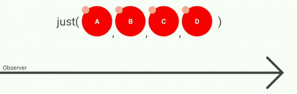
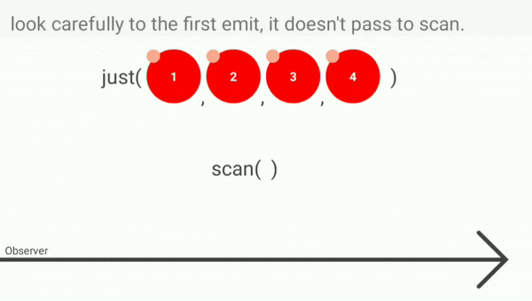
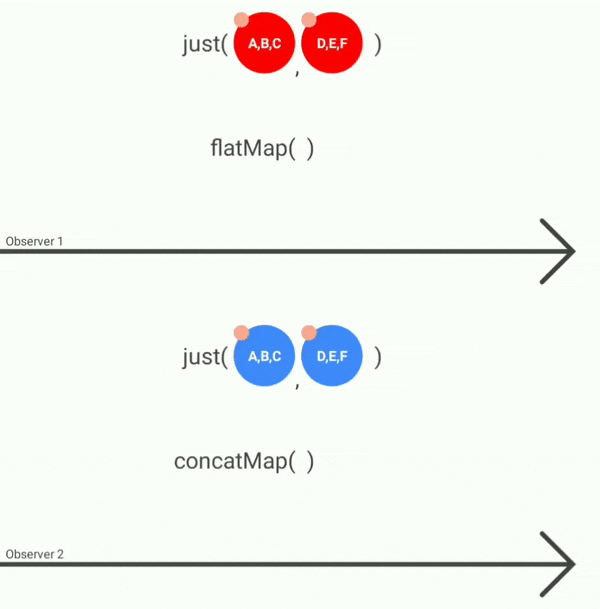
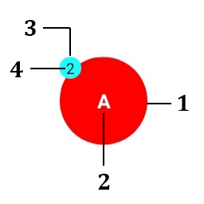

# RxLab
amazing tool to learn [ReactiveX Programming](http://reactivex.io/) with animation, schedulers and time _[project on GitHub](https://github.com/anastr/RxLab)_.

this is an open source Android application written in `Kotlin` to let you understand how **ReactiveX Programming** works,
this app will **show** you the real behavior of Reactive Programming depending on time and threads,
with snippets of code written in [RxJava](https://github.com/ReactiveX/RxJava) `3.0.6`.

for example, just operation:\


download app on Google Play:\
<a href='https://play.google.com/store/apps/details?id=com.github.anastr.rxlab'></a>

> CPU with 4 cores at least is recommended, and screen with large width.

You can read all instructions in [this story on Medium](https://medium.com/better-programming/understand-rxjava-in-a-new-way-3f43f2696c8c).

do you want to know how `scan` operation works?\


or you may don't know the difference between `flatMap` and `concatMap`?\


and more...
# Description
this is small description for emit:\


1. emit color points to the observable that coming from.
1. value.
1. the color points to the **current thread**.
   -  main thread.
   -  computation thread.
   -  io thread.
   -  single thread.
   -  other.
1. thread index that in use.

`takeTime(emit)` you will see this method in code, simply it will take random time to simulate a long operation, then it will return the emit.

# Operators
this app covered this operators:
- buffer
- combineLatest
- concatMap
- contains
- create
- distinct
- distinctUntilChanged
- elementAt
- filter
- flatMap
- fromArray
- fromIterable
- interval
- just
- map
- merge
- range
- reduce
- scan
- skip
- sorted
- switchMap
- take
- takeLast
- throttleFirst
- throttleLast
- throttleWithTimeout
- toList
- zip

and more coming soon..

# Libraries used in this app
- [RxJava](https://github.com/ReactiveX/RxJava).
- [RxAndroid](https://github.com/ReactiveX/RxAndroid).
- [CodeView-Android](https://github.com/kbiakov/CodeView-Android).
- launcher icon made by <a href="https://www.flaticon.com/authors/freepik" title="Freepik">Freepik</a> from <a href="https://www.flaticon.com/"     title="Flaticon">www.flaticon.com</a>.

# LICENSE
```

Copyright 2020 Anas Altair

Licensed under the Apache License, Version 2.0 (the "License");
you may not use this file except in compliance with the License.
You may obtain a copy of the License at

    http://www.apache.org/licenses/LICENSE-2.0

Unless required by applicable law or agreed to in writing, software
distributed under the License is distributed on an "AS IS" BASIS,
WITHOUT WARRANTIES OR CONDITIONS OF ANY KIND, either express or implied.
See the License for the specific language governing permissions and
limitations under the License.

```
